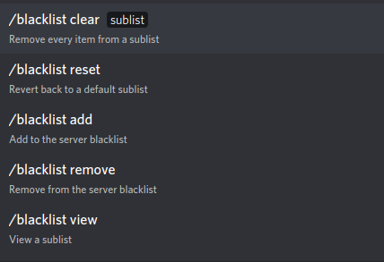

************
Blacklisting
************

This page will teach you how to make the bot block words, phrases, and links of your choosing.

What is the Blacklist?
======================
The \"blacklist\" is a list of items you want Bad Word Blocker to block. For organization, the blacklist has been broken down into 4 sublists:

* "exact-match" word sublist
* "in-word-match" word sublist
* phrase sublist
* link sublist

"exact-match" word sublist
    A list for words. The bot will only block words in this sublist if it finds an **exact** match of the word in the message. For exmaple, if you add the word "test" to this sublist, it will only block "test", not "testing", "tested", or any other variation.

"in-word-match" word sublist
    A list for words. This does the exact opposite of the above sublist; it blocks if it finds a word **anywhere** in the message. For example, if you add "test" to this list, it'll block "test", "testing", "tested", or any other variant.

phrase sublist
    A sublist for phrases. A phrase is defined as a set of 2 or more words. 

link sublist
    A sublist for website links.

Modiying the Blacklist
======================

To modify the blacklist, use the ``blacklist`` command. Go into a channel and type "/blacklist" into the message box. The following should appear:

``blacklist clear``
    Clears all items from a sublist. Has one required parameter: ``sublist``. ``sublist`` must to be the sublist you want to clear.

``blacklist reset``
    Resets a sublist to it's defaults. Has 2 required parameters: ``sublist`` and ``langauge``. ``sublist`` must be the sublist you want to reset, and ``language`` must be the verbal language you want the sublist to be in. English is currently only supported, but more are coming soon.

``blacklist add``
    Adds items to a sublist. Has two required parameters: ``sublist`` and ``items``. ``sublist`` must to be the sublist you want to add items to, and ``items`` must to be items you want to add, seperated by commas.

``blacklist remove``
    Adds items to a sublist. Has two required parameters: ``sublist`` and ``items``. ``sublist`` must to be the sublist you want to remove items from, and ``items`` must to be items you want to remove, seperated by commas.

``blacklist view``
    Allows you to view a sublist. Has one required parameter: ``sublist``. ``sublist`` must to be the sublist you want to view.

