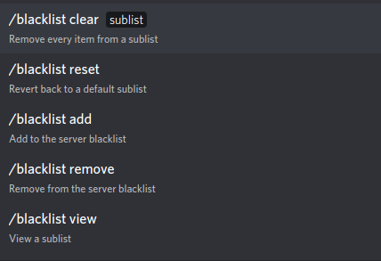

************
Blacklisting
************

This page will teach you how to make the bot block words, phrases, and links of your choosing.

Blacklist
=========
The \"blacklist\" is a list of items you want Bad Word Blocker to block. For organization, the blacklist has been broken down into 4 sublists:

* "exact-match" word sublist
* "in-word-match" word sublist
* phrase sublist
* link sublist

"exact-match" word sublist
    A list for words. The bot will only block words in this sublist if it finds an **exact** match of the word in the message. For exmaple, if you add the word "test" to this sublist, it will only block "test", not "testing", "tested", or any other variation.

"in-word-match" word sublist
    A list for words. This does the exact opposite of the above sublist; it blocks if it finds a word **anywhere** in the message. For example, if you add "test" to this list, it'll block "test", "testing", "tested", or any other variant.

phrase sublist
    A sublist for phrases. A phrase is defined as a set of 2 or more words. 

link sublist
    A sublist for website links.

Customizing the Blacklist
=========================

To modify the blacklist, use the `/blacklist` command. Go to a message box (in a channel) and type in `/blacklist`. The following should appear:

You can use these subcommands to customize the blacklist to your liking.

