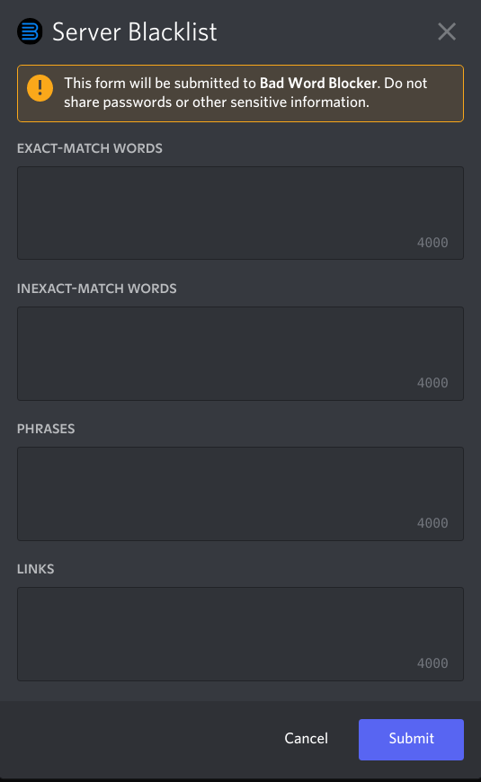

************
Blacklisting
************

This article will show you how to manage the blacklist for your server.

================================
Using the ``/blacklist`` command
================================

When you run `/blacklist`, you'll be prompted with a popup like this:

.. note::
    When you run it for the first time, you'll see that it'll be filled with defaults. Change it however you want.

As you can see in the image, it's seperated into 3 sections:

Words
    This section is for individual bad words. If you wish to block words that are not swear words, read the FAQ below. 

Phrases
    This section is for when you want to block a *group* of 2 or more words, instead of individual ones. You can add phrases like "screw you" here, for example.

Links
    For website links. Note that they have to start with either ``http`` or ``https``, or the bot won't count it as a valid link.

====================
Editing the sections 
====================

Just type in the items you wish to add, seperated by a comma, and press `Submit`. Optionally putting spaces after commas will not affect anything.

======================
Adding non-swear items
======================

While the bot is meant for blocking bad words, links, and phrases, it can also block normal ones if you add them. **Note:** If you are adding non-swear items to the **words** section, you MUST put an underscore (a ``_``) in front of the non-swear words. Read the below FAQ section for more information as to why this needs to be done.

=============
Blacklist FAQ
=============

**Question**: What does an underscore in front of a blacklisted word mean?

**Answer**: In the English language, there are some bad words in normal words (e.g. **ass**ignment). Normally, if a bad word is detected, the bot would check to make sure the word is not a part of a normal word. Putting an underscore in front of a word tells the bot to skip this step and immediately delete the message. Useful for words that are not contained within any normal words.

**Question**: Why is nothing getting blocked?

**Answer**: Make sure:

- The bot can see the channel's messages, and has the Manage Message permission. You can just give it Administrator to get rid of this problem entirely

- Make sure your blacklist is not empty. If you're trying to block good words in the words section, put an underscore in front of the good words in the blacklist

- Click on the bot's profile, and check if there's a green dot by it's logo (meaning it's online). If you see a grey, empty circle, it mean's the bot is offline. If this is the case, please join the support server and tell.

**Question**: If I remove the bot from my server, will the blacklist be deleted?

**Answer**: Yes. Everything, including strikes, limits and bypasses will be deleted. 