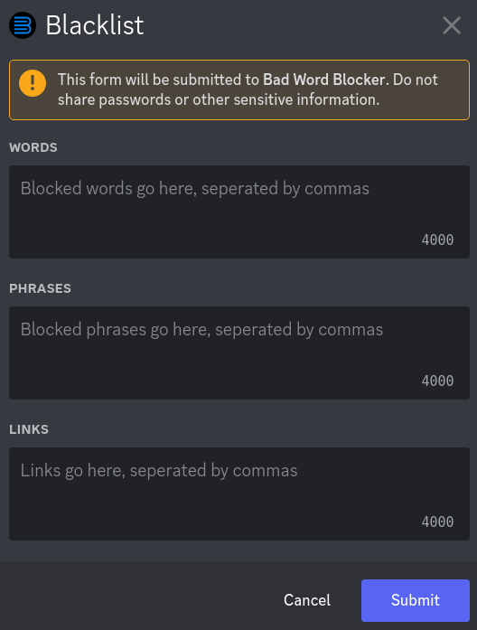

*********
Blacklist
*********
Everything the bot should block is organized in a blacklist. It's seperated into 3 parts:
- Words
- Phrases
- Links
  
Obviously, all words should go into the "word" section, all phrases should go in the "phrases" section, and all links should go in the "links" section.

=======================================
Editing with the ``/blacklist`` command
=======================================

When you run ``/blacklist``, you'll be prompted with a popup like this:

.. note::
    When you run it for the first time, you'll see that it'll be filled with defaults. You can freely change it.

Words
    This section is for individual bad words. If you wish to block words that are not swear words, read the FAQ below. 

Phrases
    This section is for when you want to block a *group* of 2 or more words, instead of individual ones. You can add phrases like "screw you" here, for example.

Links
    This section is for website links. Note that they have to start with either ``http://`` or ``https://``, or the bot won't count it as a valid link.

====================
Editing the sections 
====================

Type in the items you wish to add, seperated by a comma. Putting spaces after commas will not affect anything.

====================================
Additional Options For Word Blocking
====================================

**NOTE:** These two features are OPTIONAL. You do not need to use them. They only work with the "words" section in the blacklist.

^^^^^^^^^^^^^^^^^^^^^^^^^^^^^
Disabling Normal Word Checker
^^^^^^^^^^^^^^^^^^^^^^^^^^^^^

There are a lot of words in the English language that contain bad words within themselves. For example, the word "class" contains "ass". These types of words are called "profanity-adjacent" words.

When Bad Word Blocker sees a blacklisted word in a message, in order to make sure it is not a profanity-adjacent word, it checks if the word is a normal English word.

However, in some cases, if you are trying to block a word that's not a swear word, then you'll need to disable this check. In order to do so, put an underscore (a "_") in front of the word in the blacklist.
So for example, if you are trying to block the word "tree", then you'll need to put "_tree" into the blacklist to let the bot know the word "tree" not a swear word.

^^^^^^^^^^^^^^^^^^^^^^^^^^^^^^^^^^^^^^^^
Only Blocking if an exact-match is Found
^^^^^^^^^^^^^^^^^^^^^^^^^^^^^^^^^^^^^^^^

In some very rare cases, you may want to block a word ONLY if it is found exactly as described in the blacklist. To indicate this, put an ampersand, which is the "&" symbol, in front of the word in the blacklist.

For a rather silly example, maybe your nickname is "dogg", and you're annoyed when people call you "dog". You want them to use multiple "g"s. To solve this, you would put "&dog" in the blacklist, telling the bot to block ONLY the "dog" variation, but to leave the rest.

=============
Blacklist FAQ
=============

**Question**: When people try to circumvent the filter, will it catch them?

**Answer**: People will always find ways to get around the filter. For example, if you're trying to block the word "suck", they might type in:

- "s*ck"
- "s u c k"
- "suuuuuuuuuck"
- "s uuuuuu cc kkkkk"

Yes, Bad Word Blocker will catch most of them so you don't have to worry about manually entering in every single variation you can think of. Careful thought has been put into Bad Word Blocker regarding this issue. Note that no filter that is perfect, and if someone tries hard enough, there will *always* be a way to get around *every* filter.

**Question**: Why is nothing getting blocked?

**Answer**: Make sure:

- The bot can see the channel's messages, and has the Manage Message permission. You can just give it Administrator to get rid of this problem entirely

- Make sure your blacklist is not empty. If you're trying to block good words in the words section, put an underscore in front of the good words in the blacklist

- Click on the bot's profile, and check if there's a green dot by it's logo (meaning it's online). If you see a grey, empty circle, it mean's the bot is offline. If this is the case, please join the support server and tell.

**Question**: If I remove the bot from my server, will the blacklist be deleted?

**Answer**: Yes. Everything, including strikes, limits and bypasses will be deleted. 