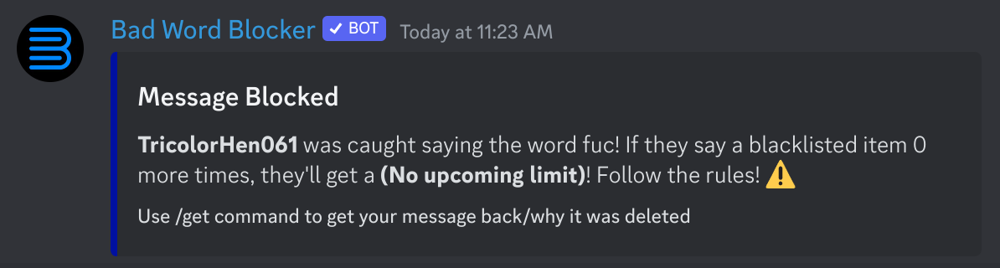

Customization
*************

You can customize how the bot behaves when it blocks a message.

Using ``/custom_embed``
====================

When you run ``/custom_embed``, you'll be prompted with a popup that has 4 things on it:

Content
    What the bot will send when it blocks a message. Sometimes, you'll want the bot to change the embed text depending on the situation. For this, we use "placeholders".

    You can use these placeholders, which will be replaced with the actual thing when an embed is sent:
        
        ``{username}`` - The author's username

        ``{tag}`` - The author's tag (the 4 numbers after their #)

        ``{mention}`` - The author's @mention

        ``{deleted_message}`` - The contents of the deleted message

        ``{strikes}`` - The new amount of strikes they have

        ``{strikes_remaining}`` - If you have a limit set up, how many strikes are left until they reach the next one. 
        
        ``{date}`` - Date of when the message was deleted
        
        ``{blacklisted_item}`` - The blacklisted item found that caused the deleted of the message
        
        ``{next_limit_action}`` - If you have a limit set up, the action of the next limit
        
        ``{next_limit_minutes}`` - If you have a limit set up, the minutes of the next limit
        
        ``{next_limit_strikes}`` - If you have a limit set up, the strikes of the next limit.

Color
    Int value of the color of the embed. Use this webpage to get the int value of the color you want: https://gist.github.com/thomasbnt/b6f455e2c7d743b796917fa3c205f812
Delete Embed after
    How long the bot should wait (in seconds) before it deletes it's own message. Set to 0 to not delete at all. Set to -1 to not send in the first place.
Title
    Title of embed

Example
=======

Example configuration:

.. image:: images/custom_embed_example.png

Resulting embed:

