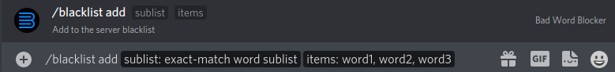
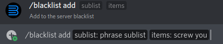
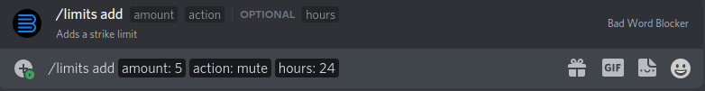
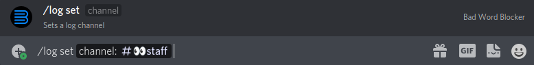

Examples
========

Adding the words ``word1`` and ``word2``, and ``word3`` to the "exact-match word list"

Adding the phrase ``screw you`` to the "phrase list"

 
Adding a limit so that when a person gets 5 strikes, they get muted for 24 hours

Set a log channel

