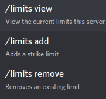

Strikes
=======

This page will teach you how strikes work, and how to use them.

What are strikes?
----------------

When a message gets blocked, the author of the message gets a "strike". Essentially, strikes are just a way of keeping track how many times users got their messages blocked.

Managing strikes
----------------

To manage a user's strikes, use the ``strikes`` command. Go in a channel and type "/strikes" into the message box. The following should appear:

.. image:: strikes_subcommands.png

``strikes view``
    View the number of strikes a user has. It has 1 optional parameter: ``user``. ``user`` must be the user whose strikes you want to see.

``strikes change``
    Change the number of strikes a user has. It has 2 required parameters: ``user`` and ``amount``. ``user`` must be the user whose strikes you want to change, and ``amount`` must be the number of strikes to set it to.

Limits
------
You can tell Bad Word Blocker to perform an action to a user- such as banning, kicking, or muting- when they reach an amount of strikes. These are called ``limits``.

Managing limits
^^^^^^^^^^^^^^^

Limits can be managed with the ``limits`` command. Go into a channel and type "/limits" into the message box. You should see the following:



``limits view``
    View the limits of the server

``limits add``
    Add a limit. Has two required parameters, and one optional parameter: ``amount``, ``action``, and ``hours``. ``amount`` is the number of strikes needed to trigger the ``action``. ``action`` is what the bot will do when the ``amount`` is reached. ``hours`` is how many hours before undoing the ``action`` (only works with ``ban`` and ``mute```).

``limits remove``
    Remove a limit. Has one required parameter: ``amount``. ``amount`` is the amount of strikes needed to trigger the limit you want to remove.