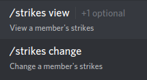

Strikes
=======

This page will teach you how strikes work, and how to use them.

What are strikes?
----------------

When a message gets blocked, the author of the message gets a "strike". Essentially, strikes are just a way of keeping track how many times users got their messages blocked.

Managing strikes
----------------

To manage a user's strikes, use the ``strikes`` command. Go in a channel and type "/strikes" into the message box. The following should appear:

``strikes view``
    View the number of strikes a user has. It has 1 optional parameter: ``user``. User must be the user whose strikes you want to see.

``strikes change``
    Change the number of strikes a user has. It has 2 required parameters: ``user`` and ``amount``. ``user`` must be the user whose strikes you want to change, and ``amount`` must be the number of strikes to set it to.

Limits
------
You can tell Bad Word Blocker to perform an action- such as banning, kicking, or muting- when a person reaches an amount of strikes. These are called ``limits``

